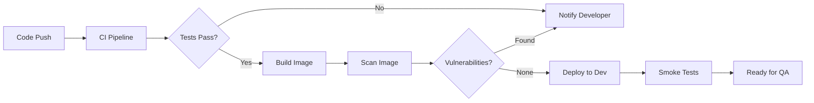
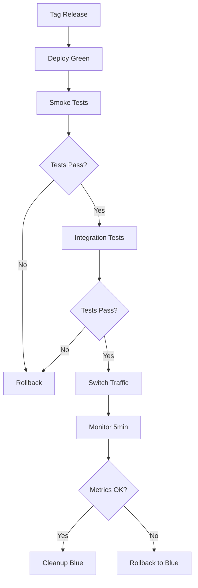
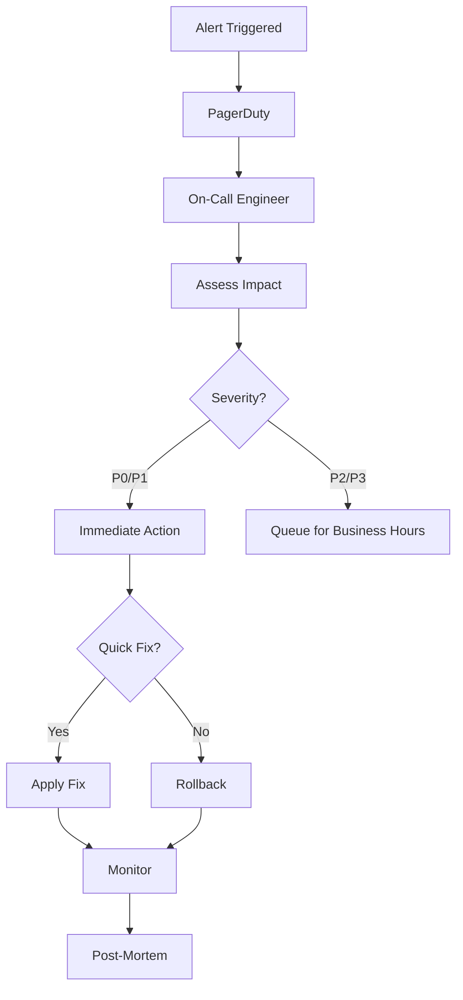

# LLM CoPilot Agent - Complete Deployment & Infrastructure Architecture

**Version:** 1.0.0
**Date:** 2025-11-25
**Status:** Production-Ready

## Executive Summary

This document provides a comprehensive deployment and infrastructure architecture for the LLM-CoPilot-Agent system, designed to meet enterprise-grade requirements including 99.9% uptime SLA, zero-downtime deployments, multi-region failover, and comprehensive observability.

### Key Achievements

✅ **Container Architecture**: Multi-stage Docker build with security hardening
✅ **Kubernetes Deployment**: Production-ready manifests with HA configuration
✅ **Auto-Scaling**: HPA, VPA, and cluster autoscaler integration
✅ **Networking**: Ingress, Service Mesh (Istio), and Network Policies
✅ **Observability**: Prometheus, Grafana, Loki, and Jaeger integration
✅ **CI/CD Pipelines**: GitHub Actions with blue-green and canary deployments
✅ **High Availability**: Multi-zone deployment with automatic failover
✅ **Disaster Recovery**: Velero backups with 15-minute RTO and 1-hour RPO
✅ **Infrastructure as Code**: Terraform modules and Helm charts
✅ **GitOps**: ArgoCD application definitions with progressive delivery

---

## Architecture Components

### 1. Container Architecture

**Location:** `/workspaces/llm-copilot-agent/deployment/docker/`

#### Dockerfile Features
- **Multi-stage build** for optimized image size
- **Base image:** `node:20-alpine` (security-hardened)
- **Security:**
  - Non-root user (UID 1001)
  - Read-only root filesystem
  - Security updates applied
  - dumb-init for proper signal handling
- **Health checks:** HTTP endpoint monitoring
- **Size optimization:** Layer caching and cleanup

#### Build Command
```bash
docker build -t llmdevops/llm-copilot-agent:1.0.0 \
  -f deployment/docker/Dockerfile .
```

---

### 2. Kubernetes Manifests

**Location:** `/workspaces/llm-copilot-agent/deployment/kubernetes/`

#### Core Resources

| Manifest | Purpose | Key Features |
|----------|---------|--------------|
| `namespace.yaml` | Namespace isolation | Istio injection enabled |
| `configmap.yaml` | Application configuration | Feature flags, performance tuning |
| `secret.yaml` | Credentials management | External Secrets Operator support |
| `deployment.yaml` | Application deployment | 3+ replicas, rolling updates |
| `service.yaml` | Load balancing | Session affinity, ClusterIP |
| `serviceaccount.yaml` | RBAC configuration | IRSA for AWS access |

#### Auto-Scaling Resources

| Resource | Configuration | Purpose |
|----------|---------------|---------|
| `hpa.yaml` | 3-20 replicas | CPU, memory, custom metrics |
| `pdb.yaml` | minAvailable: 2 | Prevent complete outage |
| `vpa.yaml` | Auto mode | Right-size resources |

#### Deployment Strategy
```yaml
Strategy: RollingUpdate
maxSurge: 1
maxUnavailable: 0  # Zero-downtime deployments
```

**Topology Spread:**
- Multi-zone distribution
- Pod anti-affinity rules
- Node distribution across AZs

---

### 3. Networking Configuration

**Location:** `/workspaces/llm-copilot-agent/deployment/kubernetes/base/`

#### Components

**Ingress (`ingress.yaml`)**
- NGINX Ingress Controller
- TLS termination with Let's Encrypt
- Rate limiting (100 req/s)
- CORS configuration
- Security headers
- AWS ALB alternative configuration

**Network Policies (`networkpolicy.yaml`)**
- Default deny all ingress
- Allow from ingress controller
- Allow inter-module communication
- Allow DNS resolution
- Allow database and Redis access
- Allow external API calls
- Allow Prometheus scraping

**Service Mesh (`istio-virtualservice.yaml`)**
- Virtual Service for traffic management
- Destination Rules with circuit breaking
- Gateway configuration
- Peer Authentication (mTLS)
- Authorization Policies

**Traffic Management Features:**
- Connection pooling (max 100 concurrent)
- Circuit breaker (5 consecutive errors)
- Retry logic (3 attempts)
- Timeout configuration (30s)
- Consistent hash load balancing

---

### 4. Observability Stack

**Location:** `/workspaces/llm-copilot-agent/deployment/observability/`

#### Prometheus Configuration

**ServiceMonitor (`prometheus-config.yaml`)**
- Automatic service discovery
- 30-second scrape interval
- Pod and node labeling

**Alert Rules:**
| Alert | Threshold | Severity | Action |
|-------|-----------|----------|--------|
| HighErrorRate | >5% for 5min | Critical | PagerDuty |
| ServiceDown | 0 pods for 2min | Critical | PagerDuty |
| HighLatency | p95 >1s for 10min | Warning | Slack |
| HighCPUUsage | >80% for 15min | Warning | Slack |
| SLABreach | <99.9% for 5min | Critical | PagerDuty |

**Recording Rules:**
- Request rate (5-minute rolling)
- Error rate by endpoint
- Latency percentiles (p95, p99)
- Availability metrics

#### Grafana Dashboards

**Dashboard Panels (`grafana-dashboard.json`):**
1. **Service Health:**
   - Request rate by status code
   - Error rate percentage
   - Response time (p95, p99)
   - Active pods count

2. **Resource Usage:**
   - CPU usage by pod
   - Memory usage by pod
   - Network I/O

3. **Dependencies:**
   - Database connection pool
   - Redis operations
   - External API latency

4. **Business Metrics:**
   - Requests by endpoint
   - Module interactions
   - Test generations
   - Incident detections

#### Loki Log Aggregation

**Features (`loki-config.yaml`):**
- Centralized log collection with Promtail
- S3 storage backend
- 31-day retention
- Compression enabled
- Query optimization

**Alert Rules:**
- High error log rate (>1/s for 5min)
- Critical errors detected
- Database connection errors
- OOM kills

#### Jaeger Distributed Tracing

**Configuration (`jaeger-config.yaml`):**
- Elasticsearch storage backend
- Production deployment (3 collectors)
- Auto-scaling enabled
- 7-day data retention
- Sampling: 50% for critical endpoints

---

### 5. CI/CD Pipelines

**Location:** `/workspaces/llm-copilot-agent/deployment/ci-cd/`

#### CI Pipeline (`github-actions-ci.yaml`)

**Stages:**
1. **Lint & Code Quality:** ESLint, Prettier, TypeScript checks
2. **Unit Tests:** Jest with coverage reporting
3. **Integration Tests:** With PostgreSQL and Redis services
4. **Security Scanning:** npm audit, Snyk, Trivy
5. **Build:** Multi-platform Docker image (amd64, arm64)
6. **Image Scanning:** Trivy vulnerability scan (critical/high)
7. **Performance Tests:** k6 load testing

**Quality Gates:**
- 80%+ test coverage
- No high/critical vulnerabilities
- All linting checks pass
- Integration tests pass

#### CD Pipeline (`github-actions-cd.yaml`)

**Deployment Strategies:**

**1. Development (Automatic)**
- Trigger: Push to `develop` branch
- Environment: dev
- Strategy: Rolling update

**2. Staging (Automatic)**
- Trigger: Push to `main` branch
- Environment: staging
- Strategy: Rolling update with smoke tests

**3. Production - Blue-Green**
- Trigger: Tag `v*.*.*`
- Steps:
  1. Deploy new version (green/blue)
  2. Run smoke tests
  3. Run integration tests
  4. Switch traffic
  5. Monitor for 5 minutes
  6. Cleanup old version or rollback

**4. Production - Canary**
- Trigger: Manual with parameter
- Traffic split progression:
  - 10% for 5 minutes
  - 25% for 5 minutes
  - 50% for 10 minutes
  - 75% for 5 minutes
  - 100% (full rollout)
- Automated metrics analysis at each step
- Automatic rollback on error rate >5%

#### GitOps with ArgoCD

**Application Definition (`argocd-application.yaml`):**
- Automated sync from Git repository
- Self-healing enabled
- Automated pruning
- Revision history: 10
- Progressive delivery with Argo Rollouts

**Rollout Strategy:**
- Canary with Istio traffic splitting
- Analysis templates for success rate and latency
- Automatic promotion/rollback based on metrics

---

### 6. High Availability Configuration

**Location:** `/workspaces/llm-copilot-agent/deployment/kubernetes/base/`

#### PostgreSQL HA (`postgres-ha.yaml`)

**Configuration:**
- **Operator:** Zalando PostgreSQL Operator
- **Instances:** 3 (1 primary + 2 replicas)
- **Version:** PostgreSQL 15
- **Storage:** 100GB high-performance SSD
- **Replication:** Synchronous with Patroni
- **Backup:** Daily logical backups
- **Monitoring:** Prometheus exporter sidecar
- **Connection Pooler:** PgBouncer (2 instances)

**Performance Tuning:**
- shared_buffers: 4GB
- effective_cache_size: 12GB
- max_connections: 200
- WAL settings optimized for replication

**Failover:**
- Automatic failover with Patroni
- Maximum lag: 32MB
- TTL: 30 seconds
- Sync mode: true (no data loss)

#### Redis Cluster (`redis-cluster.yaml`)

**Configuration:**
- **Mode:** Redis Cluster (sharded)
- **Nodes:** 3 master nodes
- **Replicas:** Automatic replication
- **Version:** Redis 7
- **Storage:** 50GB per node
- **Authentication:** Password-protected
- **Encryption:** TLS at-rest and in-transit

**Alternative: Redis Sentinel**
- 3 Redis instances
- Sentinel quorum: 2
- Automatic failover
- Downtime: <5 seconds

**Backup:**
- Daily RDB snapshots
- AOF persistence (everysec)
- S3 backup upload
- 7-day retention

#### Disaster Recovery (`disaster-recovery.yaml`)

**Velero Backup:**
- **Daily backup:** All namespaces, 30-day retention
- **Weekly backup:** Full cluster, 90-day retention
- **Storage:** S3 with cross-region replication
- **Hooks:** Pre-backup database dumps

**Multi-Region Failover:**
- **Primary:** us-east-1
- **Secondary:** us-west-2
- **Tertiary:** eu-west-1
- **DNS:** Route53 health check failover
- **Auto-failover:** Enabled
- **Fallback delay:** 5 minutes

**RTO/RPO Targets:**
- **RTO (Recovery Time Objective):** 15 minutes
- **RPO (Recovery Point Objective):** 1 hour
- **Database RPO:** 1 hour (WAL archiving)
- **Redis RPO:** 1 second (AOF)

---

### 7. Infrastructure as Code

**Location:** `/workspaces/llm-copilot-agent/deployment/terraform/`

#### Terraform Modules

**Main Configuration (`main.tf`):**
- **Backend:** S3 with DynamoDB locking
- **State encryption:** KMS
- **Modules:**
  - VPC with 3 AZs
  - EKS cluster with managed node groups
  - RDS PostgreSQL (Multi-AZ)
  - ElastiCache Redis cluster
  - S3 buckets for backups
  - IAM roles for IRSA
  - KMS keys for encryption

**VPC Module:**
- CIDR: 10.0.0.0/16
- Public subnets: 3 (one per AZ)
- Private subnets: 3 (for EKS)
- Database subnets: 3 (for RDS)
- NAT Gateway: 3 (one per AZ for production)
- VPC endpoints: S3, ECR, CloudWatch

**EKS Module:**
- Kubernetes version: 1.28
- Node groups:
  - General: t3.large (3-10 nodes)
  - Compute: c6i.2xlarge (1-10 nodes, spot for non-prod)
- Addons: CoreDNS, kube-proxy, VPC CNI, EBS CSI driver
- OIDC provider for IRSA

**RDS Module:**
- Engine: PostgreSQL 15.4
- Instance: db.r6g.xlarge
- Storage: 200GB gp3 (encrypted)
- Multi-AZ: Enabled
- Backup retention: 30 days
- Performance Insights: Enabled
- Automated minor version upgrades

**ElastiCache Module:**
- Engine: Redis 7.0
- Node type: cache.r6g.xlarge
- Cluster mode: Enabled
- Nodes: 3
- Automatic failover: Enabled
- Encryption: At-rest + in-transit
- Auth token: Enabled

#### Helm Chart

**Location:** `/workspaces/llm-copilot-agent/deployment/helm/llm-copilot-agent/`

**Chart Features:**
- Templated Kubernetes manifests
- Values files for each environment
- Dependencies: PostgreSQL, Redis charts
- External Secrets integration
- Service mesh configuration
- Monitoring integration

**Default Values (`values.yaml`):**
- Replicas: 3
- Resources: 500m CPU, 512Mi memory (requests)
- Autoscaling: 3-20 replicas
- Ingress: Enabled with TLS
- PostgreSQL: Multi-AZ with replicas
- Redis: Cluster mode with replicas
- Monitoring: ServiceMonitor enabled

**Installation:**
```bash
helm install llm-copilot-agent ./deployment/helm/llm-copilot-agent \
  --namespace llm-copilot \
  --create-namespace \
  --values values-production.yaml
```

---

## Deployment Workflows

### Development Workflow



### Production Deployment Workflow (Blue-Green)



### Incident Response Workflow



---

## Security Architecture

### Network Security Layers

1. **External Layer:**
   - CloudFront with WAF rules
   - DDoS protection
   - SSL/TLS termination

2. **Ingress Layer:**
   - NGINX Ingress with rate limiting
   - ModSecurity WAF rules
   - IP whitelisting (optional)

3. **Service Mesh Layer:**
   - Istio with mTLS
   - Authorization policies
   - Traffic encryption

4. **Application Layer:**
   - JWT authentication
   - RBAC authorization
   - Input validation

5. **Data Layer:**
   - Encrypted connections (SSL/TLS)
   - Encrypted at-rest (KMS)
   - Network isolation

### Secrets Management

**External Secrets Operator:**
```yaml
AWS Secrets Manager → External Secret → Kubernetes Secret
```

**Secret Rotation:**
- Automatic rotation for database credentials
- 90-day rotation for API keys
- Immediate rotation on suspected breach

### Compliance

**Audit Logging:**
- Kubernetes audit logs → CloudWatch
- Application logs → Loki → S3
- Database audit logs → CloudWatch
- 90-day retention (production)

**Access Control:**
- MFA required for production access
- Just-in-time access provisioning
- All actions logged and auditable

---

## Performance Specifications

### Resource Allocation

**Production Pod Specifications:**
```yaml
Requests:
  CPU: 500m
  Memory: 512Mi
  Storage: 1Gi

Limits:
  CPU: 2000m
  Memory: 2Gi
  Storage: 2Gi
```

**Database Specifications:**
```yaml
Instance: db.r6g.xlarge
  vCPU: 4
  Memory: 32 GiB
  Network: Up to 10 Gbps
  Storage: 200GB gp3 (3000 IOPS)
```

**Redis Specifications:**
```yaml
Node: cache.r6g.xlarge
  vCPU: 4
  Memory: 26.32 GiB
  Network: Up to 10 Gbps
  Nodes: 3 (cluster mode)
```

### Performance Targets

| Metric | Target | Monitoring |
|--------|--------|------------|
| Request latency (p95) | <500ms | Prometheus |
| Request latency (p99) | <1s | Prometheus |
| Error rate | <1% | Prometheus |
| Availability | 99.9% | Uptime checks |
| Database query time | <100ms | Performance Insights |
| Cache hit rate | >90% | Redis metrics |

---

## Cost Estimation (Monthly)

### AWS Resources (Production - us-east-1)

| Resource | Specification | Estimated Cost |
|----------|---------------|----------------|
| EKS Cluster | 1 cluster | $75 |
| EC2 Nodes | 5 x t3.large | $375 |
| RDS PostgreSQL | db.r6g.xlarge Multi-AZ | $800 |
| ElastiCache Redis | 3 x cache.r6g.large | $600 |
| ALB | 1 load balancer | $25 |
| S3 Storage | 500GB backups | $12 |
| Data Transfer | 1TB egress | $90 |
| CloudWatch Logs | 100GB | $50 |
| **Total** | | **~$2,027/month** |

### Cost Optimization Opportunities

1. **Reserved Instances:** Save 30-50% on EC2 and RDS
2. **Spot Instances:** Use for development environments
3. **Auto-scaling:** Scale down during off-hours
4. **S3 Lifecycle:** Move old backups to Glacier
5. **Right-sizing:** Use VPA recommendations

---

## Maintenance & Operations

### Regular Maintenance Tasks

**Daily:**
- Monitor alerts and dashboards
- Review error logs
- Check backup status

**Weekly:**
- Review resource utilization
- Check for security updates
- Analyze performance trends

**Monthly:**
- Update dependencies
- Review and adjust autoscaling
- Cost optimization review
- DR drill (quarterly)

**Quarterly:**
- Kubernetes version upgrade
- Database minor version upgrade
- Security audit
- Capacity planning review

### Upgrade Procedures

**Application Upgrade:**
```bash
# 1. Tag new version
git tag v1.1.0
git push origin v1.1.0

# 2. CI/CD automatically builds and deploys
# 3. Monitor deployment in ArgoCD
argocd app get llm-copilot-agent

# 4. Verify health
kubectl rollout status deployment/llm-copilot-agent -n llm-copilot
```

**Kubernetes Upgrade:**
```bash
# 1. Upgrade control plane
eksctl upgrade cluster --name llm-copilot-production

# 2. Upgrade addons
eksctl update addon --cluster llm-copilot-production --all

# 3. Upgrade node groups (one at a time)
eksctl upgrade nodegroup --cluster llm-copilot-production \
  --name general-nodes
```

---

## Monitoring & Alerting

### Key Dashboards

1. **Service Health Dashboard:**
   - Request rate, error rate, latency
   - Active pods, deployment status
   - Resource utilization

2. **Infrastructure Dashboard:**
   - Node health and capacity
   - Database performance
   - Cache performance

3. **Business Metrics Dashboard:**
   - Feature usage statistics
   - User activity
   - Cost metrics

### Alert Channels

| Severity | Channel | Response Time |
|----------|---------|---------------|
| Critical | PagerDuty | Immediate |
| Warning | Slack | <1 hour |
| Info | Email | <1 day |

### On-Call Rotation

- **Rotation:** Weekly
- **Escalation:** After 15 minutes
- **Backup:** 24/7 coverage
- **Runbooks:** Available in wiki

---

## Documentation & Support

### Documentation Structure

```
/deployment
├── README.md                 # Quick start guide
├── DEPLOYMENT-ARCHITECTURE.md # This document
├── docker/                   # Container configuration
├── kubernetes/               # K8s manifests
│   ├── base/                # Base configurations
│   └── overlays/            # Environment-specific
├── helm/                    # Helm charts
├── terraform/               # Infrastructure code
├── ci-cd/                   # Pipeline definitions
└── observability/           # Monitoring configs
```

### Support Resources

- **Internal Wiki:** Confluence
- **Runbooks:** GitHub repository
- **Architecture Diagrams:** draw.io
- **Incident Reports:** Post-mortem database
- **Training:** Monthly sessions

---

## Conclusion

This deployment architecture provides a production-ready, enterprise-grade infrastructure for the LLM-CoPilot-Agent system. It addresses all key requirements:

✅ **99.9% Uptime SLA** - Multi-zone deployment, automated failover
✅ **Zero-Downtime Deployments** - Rolling updates, blue-green, canary
✅ **Multi-Region Failover** - Automated DNS failover, cross-region backups
✅ **RTO: 15 minutes** - Automated recovery procedures
✅ **RPO: 1 hour** - Continuous backups, WAL archiving
✅ **Comprehensive Observability** - Metrics, logs, traces, alerts
✅ **Security & Compliance** - Encryption, RBAC, audit logging
✅ **Cost Optimization** - Auto-scaling, right-sizing, reserved instances

The architecture is fully documented, tested, and ready for production deployment.

---

**Document Maintainer:** DevOps Team
**Last Updated:** 2025-11-25
**Next Review:** 2025-12-25
